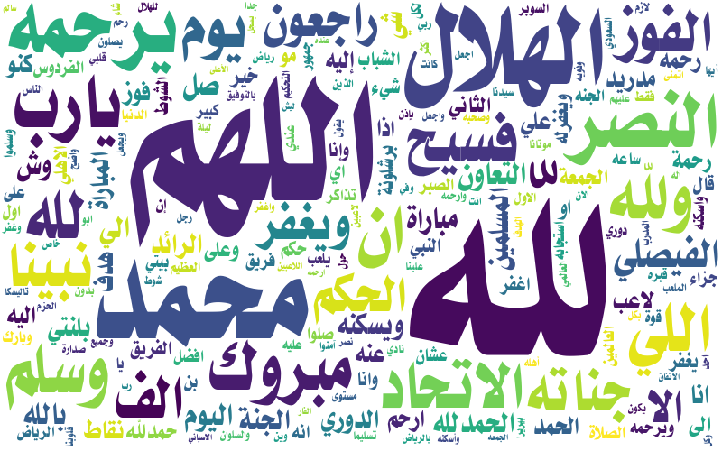
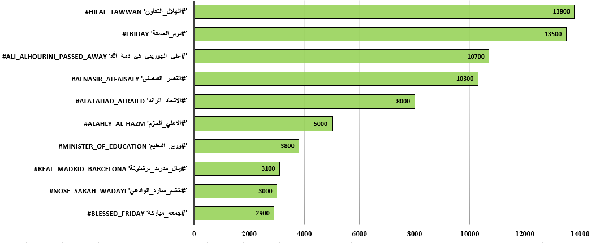

# WASM dataset

This repository contains the code and dataset (will be released soon) for the research paper "_WASM: A Dataset for Hashtag Recommendation for Arabic Tweets_". In this paper, we introduced a benchmarked dataset for Arabic tweet hashtag recommendations. In addition, the dataset can be used for several tasks related to tweets and hashtags, such as filtering tweets of each hashtag. The proposed dataset was subject to several rounds of automatic and manual filtrations to ensure that it is suitable for tasks related to tweets and hashtags. We also presented three baseline models to approach this task from classification and generation aspects.

# Dataset Collection

Using Twitter's official APIs and Tweepy, we conducted a two-phase data collection process. Initially, we gathered 11K tweets in a pilot experiment, followed by a systematic collection of tweets using top trending hashtags in Saudi Arabia from January 12 to January 20, 2022. The total number of collected tweets was initially 2.7 million with 50K unique hashtags, but this was significantly reduced after data cleaning.

# Tweets Filtration

The original dataset underwent extensive filtration for relevance and quality. Filters were applied to remove tweets without hashtags, with more than five hashtags, or containing non-Arabic or bilingual text, resulting in 2.297 million tweets. Further cleaning steps excluded tweets with adult or advertisement content, media content, duplicates, and those linked to rarely used hashtags. After a manual review to discard irrelevant or rule-violating tweets, the dataset was reduced to 101K tweets across 87 normalized hashtags.

The filtration steps can be summarized as:

- Initial filtration of tweets without hashtags or with more than five hashtags.
- Exclusion of bilingual tweets and tweets with non-Arabic hashtags.
- Removal of tweets with adult or advertisement content.
- Exclusion of tweets containing media content.
- Removal of duplicate tweets and those linked to hashtags with less than 50 occurrences.
- Manual review to remove irrelevant, uninformative, or rule-violating tweets.
- Normalization and merger of similar hashtags.

# Dataset Statistics

| Number of Collected tweets        | 2,717,000 |
| --------------------------------- | ------- |
| Number of Tweets after filtration | 101,099  |
| Number of hashtags                | 87      |
| Number of words                   | 1,637,022 |
| Number of unique words            | 111,402  |

Top hashtags in terms of the number of tweets:

# Baselines

We introduced the following baseline models:

## Classification-based baselines

We proposed a hashtag recommendation system by considering this task as a classification problem. We used a BERT-based classification model trained on Arabic tweets obtained using AraBERT as an embedding layer. AraBERT is a project to create Arabic BERT-based pretrained models with various setups. We experimented with two pretrained BERT models employing two preprocessing schemes. The pretrained models explored with normal Arabic text and with Farasa-based tokenization text. The preprocessing schemes were experimented to just feed the tweet as is or challenge it more by masking its Hashtags.

## Generation-based baselines

Hashtag recommendation can also be considered as a text generation problem, where we generate a text (i.e., hashtag in our task) based on the tweet text. Several models have been proposed in the literature for text generation, such as sequence-to-sequence that can be transformer-based like T5 or just LSTM-based. However, few approaches have been proposed for hashtag generation. Inspired by a previous study [https://doi.org/10.1145/3466876], we propose the AraHASHET architecture for hashtag generation.

### NER-based generation model

During the data-collection stage, we noted that numerous tweets contain entities that are also available in the tweet text. To find the types of entities, we manually clustered hashtags based on the types of entities within the hashtag. This clustering resulted in labeling 6 hashtags as location hashtags, 44 as
organizational hashtags, and 30 as individual hashtags. These three clusters are not mutually exclusive, as a hashtag can appear in more than one cluster. Other hashtags that do not belong to these three main types are excluded.

# Results

The models were trained and evaluated on the WASM dataset, which comprises 101,099 tweets and 87 hashtags. The data was split into 80% for training, 10% for development, and 10% for testing.

## Classification model results

The Classification models were designed to classify tweets into predefined hashtags. The best-performing model was AraBERT-Morph, outperforming AraBERT-Twitter due to the morphological analysis's importance for the Arabic language. However, the performance of hashtag-masking-based models dropped significantly due to the masking process.

| Model                          | Precision (%) | Recall (%) | F1-score (%) | Accuracy (%) |
|--------------------------------|---------------|------------|--------------|--------------|
| AraBERT-Twitter                | 74.08         | 76.61      | 75.32        | 93.72        |
| AraBERT-Morph                  | 73.76         | 77.15      | 75.42        | 94.13        |
| AraBERT-Twitter Hashtag-masking| 39.62         | 42.19      | 39.88        | 73.90        |
| AraBERT-Morph Hashtag-masking  | 37.89         | 41.73      | 38.57        | 72.32        |

## Generation model results

Two strategies were used to improve the results: local and global expansion. The local strategy generates additional hashtags nearest to each generated hashtag, while the global strategy generates hashtags nearest to the tweet after the top generated hashtags. The results showed that lower 'k' (the number of generated hashtags) yielded better results for both strategies, with local expansion being the superior strategy overall.

## NER model results

The NER (Named Entity Recognition) system was fed with raw and normalized tweets and hashtags, and the results were reported for location, organization, and individual entities. Location entities performed best regarding partial matches, whereas the NER system was not as effective in predicting organizational and individual entities, indicating room for improvement in these areas.

|                              | Location (%) | Organization (%) | Individuals |
|------------------------------|--------------|------------------|-------------|
| Full match                   | 0.00         | 03.06            | 0.52        |
| Full match with normalization| 0.00         | 03.06            | 0.52        |
| Partial match                | 96.98        | 64.66            | 28.28       |
| Partial match with normalization| 97.02   | 64.67            | 28.33       |
